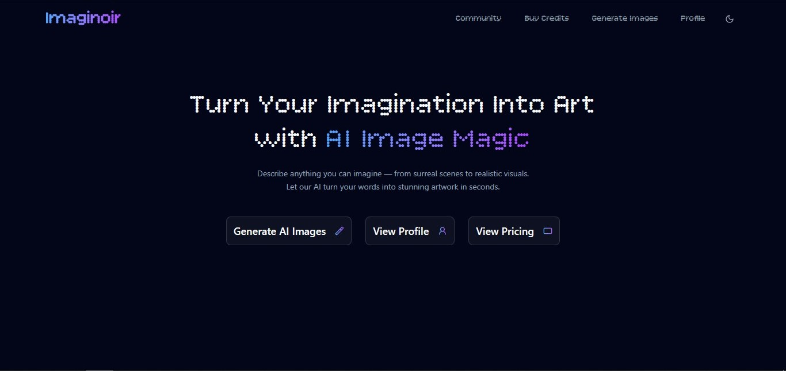

# 🎨 Imaginoir - AI Image Generator App

Imaginoir is a full-stack AI image generation web application built with the **MERN stack** (MongoDB, Express, React, Node.js), enhanced with **TypeScript**, **Tailwind CSS**, **Shadcn/ui**, and powered by **Cloudinary**, **ClipDrop API**, and **Stripe** for payments.

Users can register or sign in (including with Google), generate AI images via prompt, manage their own image gallery, share creations with a community, download images, and purchase credit packs.

---

## Features

- **Authentication**: Register/Login via email or Google OAuth
- **Credits System**: Users start with 3 free credits
- **AI Image Generation**: Prompt-based image generation using ClipDrop API
- **Cloud Storage**: Images hosted on Cloudinary
- **Payments**: Purchase more credits with Stripe Checkout & Webhooks
- **Community Sharing**: Explore AI-generated images from others
- **User Profiles**: View personal image history and details
- **Downloads**: Save images locally
- **Dark/Light Theme Toggle** with shadcn

---

## Tech Stack

- **Frontend**: React, TypeScript, Tailwind CSS, Shadcn/ui, Radix UI, React Router, Axios
- **Backend**: Express, MongoDB, Mongoose, Stripe, Cloudinary, JWT Auth, Google Auth
- **API**: ClipDrop API for AI image generation
- **Payments**: Stripe with Webhooks
- **Others**: sonner for toasts, file-saver, jwt-decode, and more

---

## App Routes

| Path              | Description                       |
|-------------------|-----------------------------------|
| `/`               | Home Page                         |
| `/auth`           | Login / Register                  |
| `/profile`        | View user profile & images        |
| `/community`      | View community shared images      |
| `/generate`       | Generate an image via prompt      |
| `/purchase`       | Buy credit packs using Stripe     |
| `*`               | Not Found                         |

---

## Screenshots

### Home Page

### Authentication Page

### Image Generation Page

### Community Feed Page

### User Profile Page

### Purchasing Page

### Stripe Payment Window

